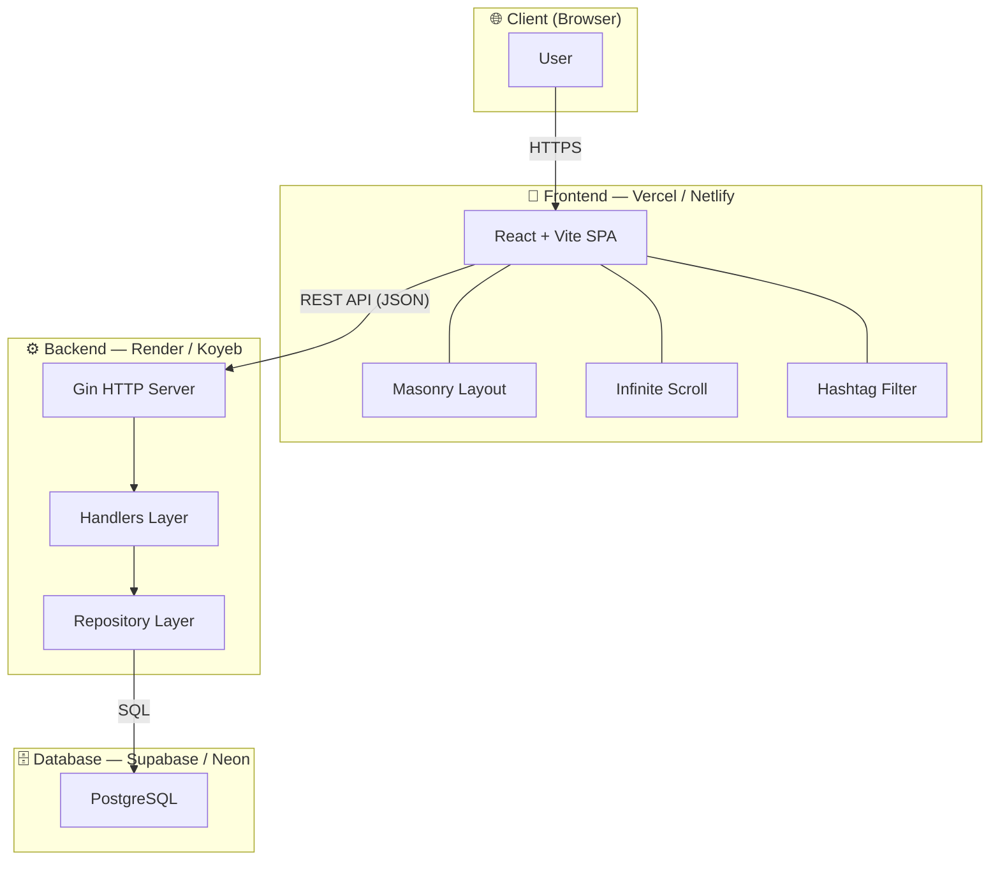
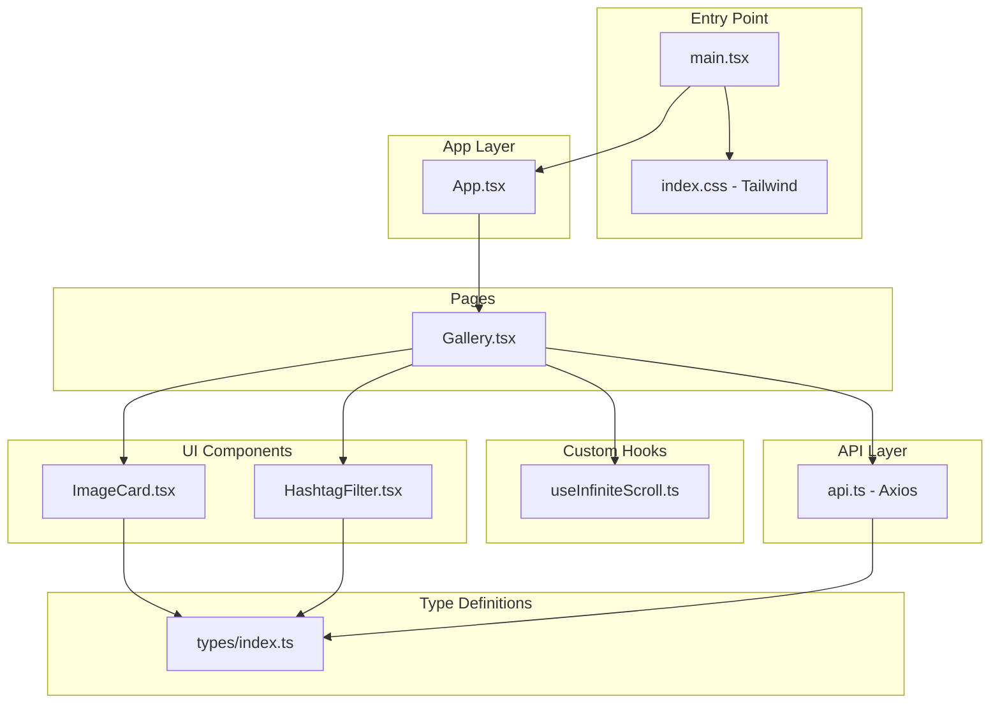
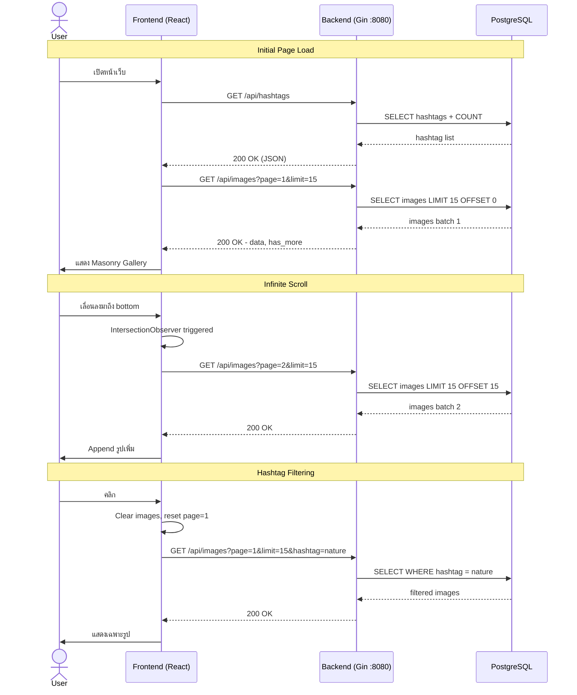

# Frontend — Image Gallery (React + Vite + TypeScript)

## System Architecture

### High-Level Architecture



---

## Technology Stack

| Technology | Purpose |
|-----------|---------|
| **React.js** | UI Library |
| **Vite** | Build tool (HMR, Fast bundling) |
| **TypeScript** | Type safety |
| **Tailwind CSS** | Styling + Responsive design |
| **react-masonry-css** | Masonry layout สำหรับรูปขนาดต่างกัน |
| **axios** | HTTP client สำหรับเรียก Backend API |
| **IntersectionObserver API** | ตรวจจับ scroll position สำหรับ Infinite Scroll |

---

## Frontend Architecture



### Layer Responsibilities

| Layer | Files | Responsibility |
|-------|-------|----------------|
| **Entry** | `main.tsx`, `index.css` | React mount point, Tailwind CSS |
| **Pages** | `Gallery.tsx` | State management, API orchestration, layout composition |
| **Components** | `ImageCard.tsx`, `HashtagFilter.tsx` | UI presentation (stateless, reusable) |
| **Hooks** | `useInfiniteScroll.ts` | IntersectionObserver logic สำหรับ Infinite Scroll |
| **Services** | `api.ts` | HTTP requests via axios, response typing |
| **Types** | `types/index.ts` | Shared TypeScript interfaces (Image, Hashtag, Response) |

---

## Project Structure

```
frontend/
├── index.html
├── vite.config.ts              ← Vite + Tailwind plugin config
├── package.json
├── tsconfig.json
├── .env.example                ← VITE_API_URL
├── .gitignore
└── src/
    ├── main.tsx                ← React entry point
    ├── App.tsx                 ← Root component
    ├── index.css               ← Tailwind CSS import
    ├── types/
    │   └── index.ts            ← TypeScript interfaces
    ├── services/
    │   └── api.ts              ← Axios API client (getImages, getHashtags)
    ├── components/
    │   ├── ImageCard.tsx        ← แสดงรูปภาพ + clickable hashtags
    │   └── HashtagFilter.tsx    ← Hashtag pill buttons + active state
    ├── hooks/
    │   └── useInfiniteScroll.ts ← IntersectionObserver custom hook
    └── pages/
        └── Gallery.tsx          ← หน้าหลัก (Masonry + Scroll + Filter)
```

---

## Request Flow



---

## Features

| Feature | Implementation | Description |
|---------|---------------|-------------|
| **Gallery Display** | `Gallery.tsx` + `ImageCard.tsx` | แสดงรูปภาพพร้อม Hashtag ใต้รูป |
| **Masonry Layout** | `react-masonry-css` | รูปขนาดไม่เท่ากัน (Dynamic Aspect Ratio) |
| **Infinite Scroll** | `useInfiniteScroll.ts` | โหลดรูปเพิ่มอัตโนมัติเมื่อ scroll ถึง bottom |
| **Hashtag Filtering** | `HashtagFilter.tsx` | คลิก hashtag → เคลียร์รูปเก่า → โหลดรูปที่ match |
| **Responsive Design** | Tailwind CSS breakpoints | 1 col (mobile) → 2 col (tablet) → 3-4 col (desktop) |

---

## API Integration

| Endpoint | Function | Usage |
|----------|----------|-------|
| `GET /api/images?page=&limit=&hashtag=` | `getImages()` | ดึงรูปภาพ + pagination + filter |
| `GET /api/hashtags` | `getHashtags()` | ดึง hashtag ทั้งหมดพร้อม count |

---

## Deployment

| Item | Detail |
|------|--------|
| **Provider** | Vercel หรือ Netlify |
| **Platform** | Serverless, Node.js Environment |
| **Specs** | Auto-scaling (Free Tier) |
| **Method** | CI/CD เชื่อมต่อ GitHub — auto build & deploy เมื่อ push |
| **Build Command** | `npm run build` |
| **Output Directory** | `dist/` |

---

## Getting Started

```bash
# 1. Install dependencies
npm install

# 2. Setup environment
cp .env.example .env
# แก้ไข VITE_API_URL ถ้า backend ไม่ได้รันที่ localhost:8080

# 3. Start dev server
npm run dev
# → http://localhost:5173

# 4. Build for production
npm run build
```

### Environment Variables

| Variable | Default | Description |
|----------|---------|-------------|
| `VITE_API_URL` | `http://localhost:8080/api` | Backend API base URL |
